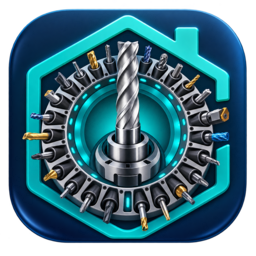

<p align="center">
  
</p>

# Home Assistant CNC Tool Magazine

[](https://github.com/EdisonACDC/home-assistant-cnc-tool-magazine/releases)
[](https://www.home-assistant.io/)
[](LICENSE)

**CNC Tool Magazine** è un add-on gratuito per Home Assistant che gestisce il magazzino utensili di una fresatrice CNC. È stato progettato per un magazzino PentaMac / Visel da 30 posizioni, ma può essere utilizzato come archivio digitale per altre fresatrici con la stessa capacità.

**CNC Tool Magazine** is a free Home Assistant add-on for managing a 30-position CNC milling machine tool magazine. It stores tool offsets, dimensions, cutting data by material and the complete history of replaced tools.

## Funzioni principali

- 30 posizioni fisse corrispondenti ai posti fisici del magazzino CNC.
- Correttori utensile modificabili `T`, `D` e `H`.
- Descrizione, tipo, diametro, lunghezza, numero di taglienti e note.
- 17 tipi selezionabili con icone realistiche per frese, punte, maschi, pettini per filetti, alesatori, bareni e tastatori.
- Passo filettatura per maschi e pettini, con calcolo specifico dell'avanzamento.
- Parametri di taglio separati per ogni materiale: Vc, giri/min, fz, avanzamento, ap, ae e refrigerante.
- Un utensile montato per posizione e storico completo degli utensili sostituiti.
- Ripristino rapido di un utensile archiviato con tutti i suoi parametri.
- Popup separato per ogni materiale.
- Calcolo automatico di giri, velocità di taglio e avanzamento.
- Duplicazione utensili e copia dei parametri materiali tra posizioni.
- Stato dell'utensile, timer persistente e vita residua calcolata automaticamente.
- QR per aprire direttamente ogni posizione e foglio di etichette stampabile.
- Magazzino Officina per gli utensili non montati, con montaggio e spostamento senza ricreare i dati.
- Registro automatico dei movimenti degli utensili.
- Libreria materiali modificabile con modelli per C45, inox, alluminio e ottone.
- Allegati PDF, schede tecniche e fotografie associati permanentemente all'utensile.
- Ricerca globale in utensili montati, storico, Officina, materiali e nomi dei documenti.
- Esportazione completa in PDF A4, pronta per stampa e condivisione.
- Esportazione e ripristino JSON con backup di sicurezza automatico.
- Database SQLite persistente incluso nei backup di Home Assistant.
- Interfaccia responsive per iPhone, Android, tablet e computer.

## Installazione in Home Assistant

1. Apri **Impostazioni → App → App store**.
2. Apri il menu **⋮ → Repository**.
3. Aggiungi questo indirizzo:

```text
https://github.com/EdisonACDC/home-assistant-cnc-tool-magazine
```

4. Seleziona **CNC Tool Magazine**.
5. Premi **Installa**.
6. Attiva **Avvia all'avvio** e **Mostra nella barra laterale**.
7. Avvia l'add-on.

## Come funziona

Ogni scheda numerata rappresenta la stessa posizione fisica nel magazzino della fresatrice. Aprendo una posizione puoi registrare l'utensile montato e aggiungere più materiali, ognuno con i propri parametri di lavorazione.

Quando sostituisci un utensile, premi **Archivia e inserisci nuovo**. L'utensile precedente rimane nello storico della posizione insieme alle icone, alle misure, alle note e a tutti i parametri di taglio. Con **Monta** puoi ripristinarlo in qualsiasi momento.

## Esportazione PDF e backup JSON

- **Esporta PDF** crea un rapporto con tutte le 30 posizioni, gli utensili montati, quelli archiviati e le schede di taglio per materiale.
- **Esporta JSON** crea una copia strutturata dei dati utile come backup.
- **Importa JSON** ripristina un backup e salva prima una copia automatica dello stato corrente.

## Compatibilità

- Home Assistant OS con supporto add-on.
- Architetture `amd64` e `aarch64`.
- Interfaccia Home Assistant Ingress.
- Fresatrice PentaMac con controllo Visel; l'integrazione diretta con il controllo macchina non è ancora inclusa.

## Dati e sicurezza

I dati rimangono sul server Home Assistant nel database `/data/cnc_tools.db`. L'add-on non richiede accesso privilegiato, rete host o accesso alle API di Home Assistant. L'interfaccia è riservata agli amministratori tramite Ingress.

## Parole chiave

Home Assistant CNC tool magazine, CNC tool management, milling machine tool database, magazzino utensili CNC, gestione utensili fresatrice, parametri di taglio CNC, PentaMac Visel, CNC tooling database.

## Versione

Versione corrente: **1.3.0**. Consulta il [changelog](cnc_tool_magazine/CHANGELOG.md) per tutte le modifiche.

## Licenza

Distribuito con licenza [MIT](LICENSE).
